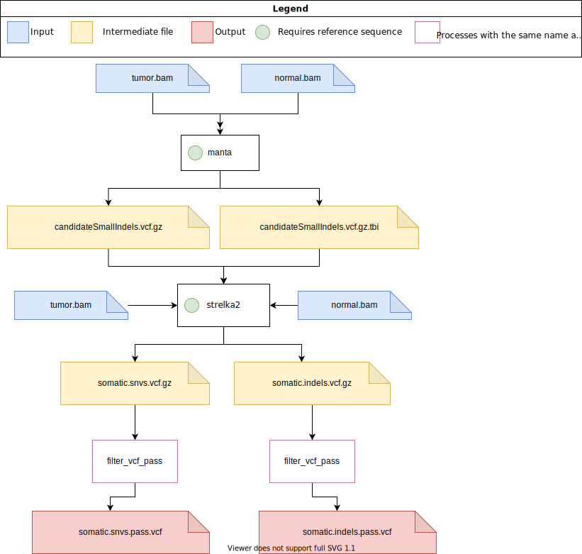

# pipeline-call-sSNV

## Overview
This pipeline performs somatic SNV calling given a pair of tumor/normal BAM. 3 somatic SNV callers are available and described below. Each caller will run independently of each other.

## Somatic SNV callers:
* Somatic Sniper
* Strelka2
* Mutect2


### SomaticSniper

#### Tools
##### SomaticSniper
SomaticSniper source: https://github.com/genome/somatic-sniper  
Version: SomaticSniper v1.0.5.0 (Released on Jul 16, 2015)  
Docker image: blcdsdockerregistry/call-ssnv:somaticsniper-v1.0.5.0
##### bam-readcount
bam-readcount source: https://github.com/genome/bam-readcount  
Version: v0.8.0 Release (Released on Oct 21, 2016)  
Docker image: blcdsdockerregistry/call-ssnv:bam-readcount-v0.8.0

### Strelka2

#### Tools
##### Manta
Manta source: https://github.com/Illumina/manta
Version: v1.6.0 (Released on Jul 9, 2019)
Docker image: blcdsdockerregistry/call-ssnv:manta-v1.6.0
##### Strelka2
Strelka2 source: https://github.com/Illumina/strelka
Version: v2.9.10 (Released on Nov 7, 2018)
Docker image: blcdsdockerregistry/call-ssnv:strelka2-v2.9.10

### Mutect 2
#### Tools
##### GATK
GATK source: https://github.com/broadinstitute/gatk
Version: 4.2.4.1 (Released on Jan 4, 2022)
Docker image: broadinstitute/gatk:4.2.4.1

## Inputs
| Input       | Type   | Description                               | Location    |
|-------------|--------|-------------------------------------------|-------------|
| sample_name | string | The name/ID of the sample                 | Config File |
| algorithm   | list   | List containing a combination of somaticsniper, strelka2 or mutect2 | Config File |
| tumor       | string | The path to the tumor .bam file (.bai file must exist in same directory) | Config File |
| normal      | string | The path to the normal .bam file (.bai file must exist in same directory) | Config File |
| reference   | string | The reference .fa file (.fai and .dict file must exist in same directory) | Config File |
| output_dir  | string | The location where outputs will be saved  | Config File |
| output_log_dir | string | The location where log files (.command.\*) will be saved | 
Config File |
| save_intermediate_files | boolean | Whether to save intermediate files | Config File |
| workdir | string | The path of working directory for Nextflow, storing intermediate files and logs. The default is `/scratch` with `ucla_cds` and should only be changed for testing/development. Changing this directory to `/hot` or `/tmp` can lead to high server latency and potential disk space limitations, respectively. | Config File | 

## Strelka2 Specific Configuration
| Input       | Type   | Description                               | Location    |
|-------------|--------|-------------------------------------------|-------------|
| exome       | string | Adds the '--exome' option when running manta and strelka2 | Config File |


## Mutect2 Specific Configuration
| Input       | Type   | Description                               | Location    |
|-------------|--------|-------------------------------------------|-------------|
| split_intervals_extra_args | string | Additional arguments for the SplitIntervals command | Config File |
| mutect2_extra_args | string | Additional arguments for the Mutect2 command | Config File |
| filter_mutect_calls_extra_args | string | Additional arguments for the FilterMutectCalls command | Config File |
| gatk_command_mem_diff | nextflow.util.MemoryUnit | How much to subtract from the task's allocated memory where the remainder is the Java heap max. (should not be changed unless task fails for memory related reasons) | Config File |
| scatter_count | int | Number of intervals to split the desired interval into. Mutect2 will call each interval seperately. | Config File |
| intervals   | string | A GATK accepted interval list file containing intervals to search for somatic mutations. <br/> If empty or missing, will optimally partition canonical genome based on scatter_count and process non-canonical regions separately. This is the default use case. <br/> If specified and evaluates to a valid path, will pass that path to GATK to restrict the genomic regions searched. | Config File |
| tumor_only_mode | boolean | An option to use the mutect2 algorithm when no normal control samples exist in the datasets |

## Outputs
| Output                                         | Type         | Description                   |
|------------------------------------------------|--------------|-------------------------------|
| somaticsniper_{sample_name}_hc.vcf             | .vcf         | Final VCF file (somaticsniper)|
| strelka2_{sample_name}_somatic_snvs_pass.vcf   | .vcf         | Final VCF file (strelka2)     |
| strelka2_{sample_name}_somatic_indels_pass.vcf | .vcf         | Indel VCF file (strelka2)     |
| mutect2_{sample_name}_filtered_pass.vcf        | .vcf         | Final VCF file (mutect2)      |
| report.html, timeline.html, trace.txt          | .html & .txt | Nextflow logs                 |

#### How to run the pipeline
1. Download the stable release [here](https://github.com/uclahs-cds/pipeline-call-sSNV/releases) or the development version by cloning the GitHub repository to your machine.
2. Fill in the params section of the [config file](https://github.com/uclahs-cds/pipeline-call-sSNV/blob/main/pipeline/nextflow.config). 
3. Run the pipeline using the [Nextflow submission script](https://github.com/uclahs-cds/tool-submit-nf) with the command below:
```bash
python path/to/submit_nextflow_pipeline.py \
    --nextflow_script path/to/call-sSNV.nf \
    --nextflow_config path/to/nextflow.config \
    --pipeline_run_name <sample_name> \
    --partition_type F72 \
    --email jdoe@mednet.ucla.edu
```
<b><i>Notes:</i></b>
> The reference .fa file in config file should be the same with the reference genome that genereates the input bam files.

---


## Testing and Validation

Testing was performed primarily in the Boutros Lab SLURM Development cluster using F72 node. Metrics below will be updated where relevant with additional testing and tuning outputs.

### Test Data Set

| Data Set | Run Configuration | Output Dir | Control Sample | Tumor Sample |  
| ------ | ------ | ------- | ------ | ------- |
| A-full-P2 |/hot/users/maotian/analysis/call-sSNV/all/A-full/nextflow.config | /hot/users/maotian/analysis/call-sSNV/all/A-full/output | HG002.N | P2 |  

### Performance Validation

#### Mutect2

|process_name                                 |max_duration     |max_cpu |max_peak_vmem |
|:--------------------------------------------|:----------------|:-------|:-------------|
|call_sSNVInNonAssembledChromosomes_Mutect2   |5.51 hours       |155.4%  |33.2 GB       |
|run_SplitIntervals_GATK                      |2.07 minutes     |83.1%   |32.1 GB       |
|call_sSNVInAssembledChromosomes_Mutect2      |2.74 hours       |152.8%  |7.1 GB        |
|run_MergeMutectStats_GATK                    |7.4s             |90.9%   |32.1 GB       |
|run_MergeVcfs_GATK                           |26.4s            |94%     |32.1 GB       |
|run_FilterMutectCalls_GATK                   |8.97 minutes     |97.9%   |32.1 GB       |

#### SomaticSniper
|process_name                           |max_duration           |max_cpu |max_peak_vmem |
|:--------------------------------------|:----------------------|:-------|:-------------|
|convert_BAM2Pileup_SAMtools            |12.41 hours            |91.7%   |838.9 MB      |
|call_sSNV_SomaticSniper                |12.05 hours            |98.5%   |916.1 MB      |
|create_IndelCandidate_SAMtools         |56.8s                  |95.3%   |56.6 MB       |
|apply_NormalIndelFilter_SomaticSniper  |6.6s                   |92%     |154.7 MB      |
|generate_ReadCount_bam_readcount       |29.55 minutes          |80.7%   |542.8 MB      |


#### Strelka2
|process_name                                |max_duration        |max_cpu |max_peak_vmem |
|:-------------------------------------------|:-------------------|:-------|:-------------|
|call_sIndel_Manta                           |1.41 hours          |2724.2% |23.2 GB       |
|call_sSNV_Strelka2                          |22.54 hours         |511.3%  |17.4 GB       |
|filter_VCF                                  |6.3s                |92.4%   |11.1 MB       |

---

## License

Authors: Bugh Caden (YBugh@mednet.ucla.edu), Helena Winata (HWinata@mednet.ucla.edu), Mao Tian (maotian@mednet.ucla.edu).

Call-sSNV is licensed under the GNU General Public License version 2. See the file LICENSE for the terms of the GNU GPL license.

This pipeline performs somatic SNV calling on a pair of normal/tumor BAMs. Mutect2, SomaticSniper, and Strelka2 are currently available in this pipeline.

Copyright (C) 2021 University of California Los Angeles ("Boutros Lab") All rights reserved.

This program is free software; you can redistribute it and/or modify it under the terms of the GNU General Public License as published by the Free Software Foundation; either version 2 of the License, or (at your option) any later version.

This program is distributed in the hope that it will be useful, but WITHOUT ANY WARRANTY; without even the implied warranty of MERCHANTABILITY or FITNESS FOR A PARTICULAR PURPOSE. See the GNU General Public License for more details.

