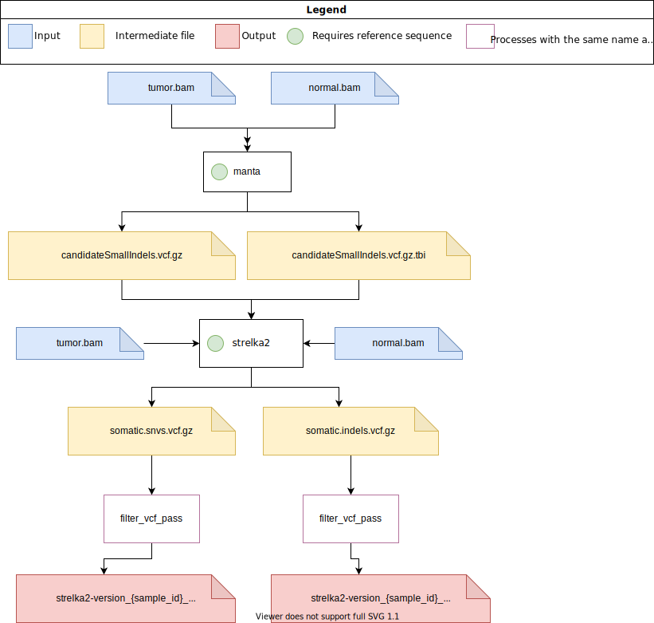

# pipeline-call-sSNV

## Somatic SNV callers:
* Somatic Sniper
* Strelka2
* Mutect2

### SomaticSniper

#### Tools
##### SomaticSniper
SomaticSniper source: https://github.com/genome/somatic-sniper  
Version: SomaticSniper v1.0.5.0 (Released on Jul 16, 2015)  
Docker image: blcdsdockerregistry/call-ssnv:somaticsniper-v1.0.5.0
##### bam-readcount
bam-readcount source: https://github.com/genome/bam-readcount  
Version: v0.8.0 Release (Released on Oct 21, 2016)  
Docker image: blcdsdockerregistry/call-ssnv:bam-readcount-v0.8.0

### Strelka2

#### Tools
##### Manta
Manta source: https://github.com/Illumina/manta
Version: v1.6.0 (Released on Jul 9, 2019)
Docker image: blcdsdockerregistry/call-ssnv:manta-v1.6.0
##### Strelka2
Strelka2 source: https://github.com/Illumina/strelka
Version: v2.9.10 (Released on Nov 7, 2018)
Docker image: blcdsdockerregistry/call-ssnv:strelka2-v2.9.10

### Mutect 2
#### Tools
##### GATK
GATK source: https://github.com/broadinstitute/gatk
Version: 4.2.0.0 (Released on Feb 19, 2021)
Docker image: broadinstitute/gatk:4.2.0.0

## Inputs
| Input       | Type   | Description                               | Location    |
|-------------|--------|-------------------------------------------|-------------|
| sample_name | string | The name/ID of the sample                 | Config File |
| algorithm   | list   | List containing a combination of somaticsniper, strelka2 or mutect2) | Config File |
| tumor       | string | The path to the tumor .bam file (.bai file must exist in same directory) | Config File |
| normal      | string | The path to the normal .bam file (.bai file must exist in same directory) | Config File |
| reference   | string | The reference .fa file (.fai file must exist in same directory) | Config File |
| output_dir  | string | The location where outputs will be saved  | Config File |
| output_log_dir | string | The location where log files (.command.*) will be saved | Config File |
| save_intermediate_files | boolean | Whether to save intermediate files | Config File |

## Strelka2 Specific Configuration
| Input       | Type   | Description                               | Location    |
|-------------|--------|-------------------------------------------|-------------|
| exome       | string | Adds the '--exome' option when running manta and strelka2 | Config File |

## Mutect2 Specific Configuration
| Input       | Type   | Description                               | Location    |
|-------------|--------|-------------------------------------------|-------------|
| split_intervals_extra_args | string | Additional arguments for the SplitIntervals command | Config File |
| mutect2_extra_args | string | Additional arguments for the Mutect2 command | Config File |
| filter_mutect_calls_extra_args | string | Additional arguments for the FilterMutectCalls command | Config File |
| gatk_command_mem_diff | nextflow.util.MemoryUnit | How much to subtract from the task's allocated memory where the remainder is the Java heap max. (should not be changed unless task fails for memory related reasons) | Config File |
| scatter_count | int | Number of intervals to split the desired interval into. Mutect2 will call each interval seperately. | Config File |
| intervals   | string | A GATK accepted interval list file containing intervals to search for somatic mutations.   If empty or missing, will optimally partition canonical genome based on scatter_count and process non-canonical regions separately. This is the default use case.   If specified and evaluates to a valid path, will pass that path to GATK to restrict the genomic regions searched. | Config File |

## Outputs
| Output                                         | Type         | Description                   |
|------------------------------------------------|--------------|-------------------------------|
| somaticsniper_{sample_name}_hc.vcf             | .vcf         | Final VCF file (somaticsniper)|
| strelka2_{sample_name}_somatic_snvs_pass.vcf   | .vcf         | Final VCF file (strelka2)     |
| strelka2_{sample_name}_somatic_indels_pass.vcf | .vcf         | Indel VCF file (strelka2)     |
| mutect2_{sample_name}_filtered_pass.vcf        | .vcf         | Final VCF file (mutect2)      |
| report.html, timeline.html, trace.txt          | .html & .txt | Nextflow logs                 |

#### How to run the pipeline
1. Fill in the params section of the config file
2. Run the pipeline using the [submission script](https://github.com/uclahs-cds/tool-submit-nf)

