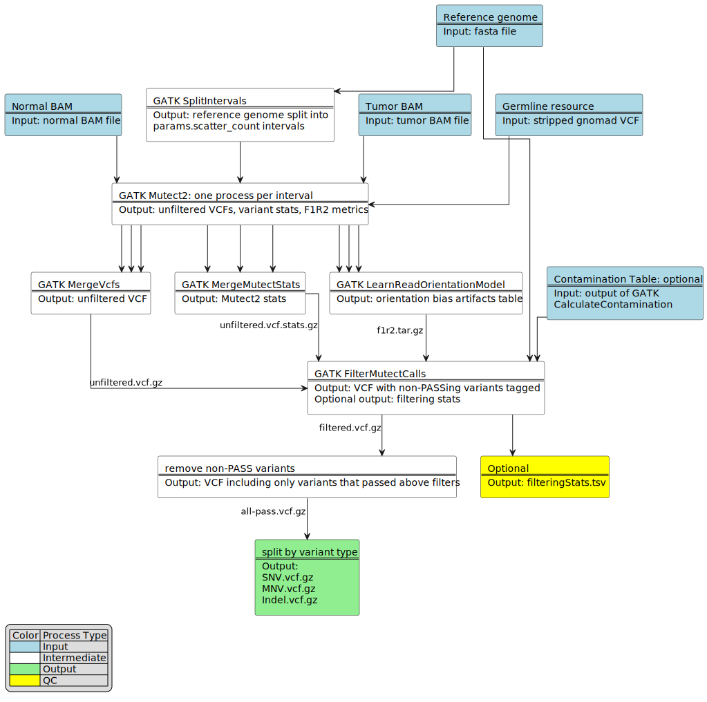

# pipeline-call-sSNV Flow Diagrams and Tool Links

- [Variant Calling](#variant-calling)
  - [SomaticSniper](#somaticsniper)
  - [Strelka2](#strelka2)
  - [Mutect2](#mutect2)
  - [MuSE](#muse)
- [Variant Intersection](#variant-intersection)
  - [BCFtools, VennDiagram and vcf2maf](#variant-intersection)

---

## Variant Calling
### SomaticSniper

#### Tools
##### SomaticSniper
SomaticSniper source: https://github.com/genome/somatic-sniper
Version: SomaticSniper v1.0.5.0 (Released on Jul 16, 2015)
GitHub Package: ghcr.io/uclahs-cds/somaticsniper:1.0.5.0
##### bam-readcount
bam-readcount source: https://github.com/genome/bam-readcount
Version: v0.8.0 Release (Released on Oct 21, 2016)
GitHub Package: ghcr.io/uclahs-cds/bam-readcount:0.8.0

### Strelka2

#### Tools
##### Manta
Manta source: https://github.com/Illumina/manta
Version: v1.6.0 (Released on Jul 9, 2019)
GitHub Package: ghcr.io/uclahs-cds/manta:1.6.0
##### Strelka2
Strelka2 source: https://github.com/Illumina/strelka
Version: v2.9.10 (Released on Nov 7, 2018)
GitHub Package: ghcr.io/uclahs-cds/strelka2:2.9.10

### Mutect2

#### Tools
##### GATK
GATK source: https://github.com/broadinstitute/gatk
Version: 4.2.4.1 (Released on Jan 4, 2022)
Docker Image: broadinstitute/gatk:4.2.4.1

### MuSE

#### Tools
##### MuSE
MuSE source: https://github.com/wwylab/MuSE
Version: 2.0 (Released on Aug 25, 2021)
GitHub Package: https://github.com/uclahs-cds/docker-MuSE/pkgs/container/muse

## Variant Intersection

#### Tools
##### BCFtools
BCFtools source: https://samtools.github.io/bcftools
Version: 1.17 (Released on Feb 21, 2023)
GitHub Package: https://github.com/uclahs-cds/bcftools:1.17
##### VennDiagram
VennDiagram source: https://github.com/uclahs-cds/public-R-VennDiagram
Version: 1.7.3 (Released on Apr 12, 2022)
##### vcf2maf
vcf2maf source: ghcr.io/mskcc/vcf2maf/vcf2maf
Version: v1.6.18
GitHub Package: https://github.com/mskcc/vcf2maf
